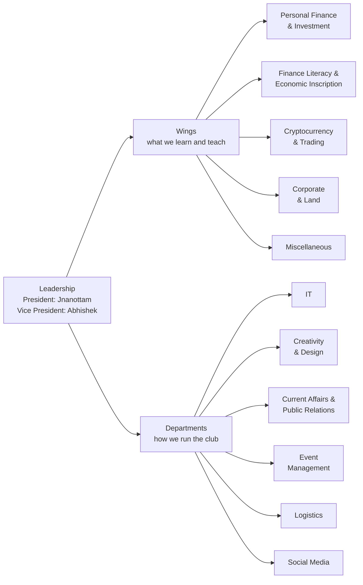

<div align="center">

# NEXUS

### The Finance Club of MSRIT

M S Ramaiah Institute of Technology, Bengaluru

*Where engineers learn the language of money.*

[Latest updates](updates/README.md) · [Events](events/README.md) · [Wings](wings/README.md) · [Departments](departments/README.md) · [Resources](resources/README.md) · [Join the team](JOIN.md)

</div>

---

This repository is the club's **single source of truth**: who's on the team, what's coming up, what just happened, and where to learn more. Our social media posts link back here.

> **Not financial advice.** NEXUS is a student-run educational club. Read the [disclaimer](#disclaimer) before acting on anything you learn here.

## Latest updates

| Date | Update |
| --- | --- |
| 07 Oct 2026 | [Meet the NEXUS core team](updates/2026-10-07-meet-the-core-team.md) |

[See all updates →](updates/README.md)

## About NEXUS

NEXUS is the finance club of MSRIT. It's open to students from **every branch** who are curious about money, markets and the economy. You don't need a commerce background, just curiosity.

We run sessions, workshops, competitions and content across:

- **Personal finance & investing**: budgeting, saving, mutual funds, equities and building wealth early.
- **Economics & financial literacy**: making sense of the Budget, RBI policy, inflation and the news.
- **Markets, trading & crypto**: how markets work, analysis, risk management and digital assets.
- **Corporate finance & real estate**: financial statements, valuation, IPOs, M&A and land as an asset class.
- **Careers & everything else**: CA, CFA, investment banking, fintech, behavioural finance and more.

## Leadership

| Role | Name |
| --- | --- |
| President | Jnanottam |
| Vice President | Abhishek |

## How the club is organised

**Wings** own a subject area. They decide what members learn and run the sessions on it. **Departments** keep the club running: tech, design, PR, events, logistics and social media.



### Wings

| Wing | Team | Focus |
| --- | --- | --- |
| [Personal Finance & Investment](wings/personal-finance-and-investment.md) | Mihir Khaitan<br/>Harsh Anand | Budgeting, saving, mutual funds, equities, insurance, goal planning |
| [Finance Literacy & Economic Inscription](wings/finance-literacy-and-economic-inscription.md) | *[Open positions](JOIN.md)* | Economics explainers, Budget & RBI breakdowns, the club's writing |
| [Cryptocurrency & Trading](wings/cryptocurrency-and-trading.md) | Shubapriya Banerjee<br/>Santana Sarraf | Blockchain, digital assets, market analysis, risk management |
| [Corporate & Land](wings/corporate-and-land.md) | Rutuja<br/>*[Open position](JOIN.md)* | Corporate finance, valuation, IPOs, M&A, real estate |
| [Miscellaneous](wings/miscellaneous.md) | Sowmya BH<br/>*[Open position](JOIN.md)* | Careers, behavioural finance, fintech, quizzes, cross-wing projects |

### Departments

| Department | Team | Responsible for |
| --- | --- | --- |
| [IT](departments/it.md) | Kshiraja Nelapati<br/>*[Open position](JOIN.md)* | This repository, digital tools, registrations, event tech |
| [Creativity & Design](departments/creativity-and-design.md) | *[Open positions](JOIN.md)* | Posters, creatives, brand identity, presentation templates |
| [Current Affairs & Public Relations](departments/current-affairs-and-public-relations.md) | *[Open positions](JOIN.md)* | News digests, speakers, partners, outreach |
| [Event Management](departments/event-management.md) | Vihaan<br/>Namith A Mathod | Planning and running every event end to end |
| [Logistics](departments/logistics.md) | Yukthaa Reddy<br/>*[Open position](JOIN.md)* | Venues, permissions, equipment, budgets |
| [Social Media](departments/social-media.md) | Lekhika (Video Editor)<br/>Sumitha (Script Writer)<br/>Ishaan (Videographer) | Reels, explainers, event coverage |

## We're hiring

Several core team positions are open, including **every** position in Finance Literacy & Economic Inscription, Creativity & Design, and Current Affairs & Public Relations. See [JOIN.md](JOIN.md) for the full list and how to apply.

## How to stay updated

1. **Watch this repository.** Click **Watch → Custom → Releases** at the top of this page. Every new update is published as a [release](https://github.com/jnanottamgy/NEXUS/releases), so you'll get a GitHub notification (and an email, if you have those turned on). Pick **All Activity** instead to also see event proposals and ideas as they come in.
2. **Prefer RSS?** Subscribe to [`releases.atom`](https://github.com/jnanottamgy/NEXUS/releases.atom) in any feed reader.
3. **Check [`updates/`](updates/README.md)**, where every announcement, event and recap is posted, newest first.
4. **Check [`events/`](events/README.md)** for what's coming up and the finance calendar we plan around.

## Get involved

- **Have an idea for a session, post or event?** [Open an issue](https://github.com/jnanottamgy/NEXUS/issues/new/choose) using the *Event proposal* or *Idea* form.
- **Spotted something wrong or outdated?** Use the *Correction* form.
- **On the core team?** [CONTRIBUTING.md](CONTRIBUTING.md) explains how to post updates and keep the roster current. No coding needed.

## Repository map

```
NEXUS/
├── README.md              you are here
├── JOIN.md                open positions and how to apply
├── CONTRIBUTING.md        how the core team keeps this repo current
├── updates/               announcements, event news and recaps (newest first)
├── events/                upcoming and past events, the finance calendar
├── wings/                 the five wings: what each covers and runs
├── departments/           the six departments: who does what
├── resources/             curated learning resources, by wing
└── .github/ISSUE_TEMPLATE forms for event proposals, ideas, joining and corrections
```

## Disclaimer

NEXUS is a student-run educational club. Nothing in this repository, in our sessions or on our social media is investment, tax or legal advice, or a recommendation to buy or sell any security, crypto-asset or other financial product. Markets involve risk, and crypto-assets are not legal tender in India and can be highly volatile. Do your own research, and consult a SEBI-registered investment adviser or another qualified professional before making financial decisions.

<!-- Add the club's official Instagram / LinkedIn / email links here once they're ready. -->
