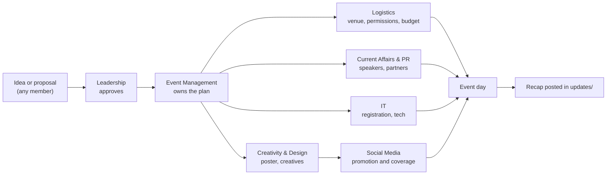

# Departments

[← NEXUS home](../README.md)

Departments keep the club running. Wings decide *what* we teach; departments make sure it reaches people on time, looks good and runs smoothly.

| Department | Responsible for |
| --- | --- |
| [IT](it.md) | This repository, digital tools, registrations, event tech |
| [Creativity & Design](creativity-and-design.md) | Posters, creatives, brand identity, presentation templates |
| [Current Affairs & Public Relations](current-affairs-and-public-relations.md) | News digests, speakers, partners, outreach |
| [Event Management](event-management.md) | Planning and running every event end to end |
| [Logistics](logistics.md) | Venues, permissions, equipment, budgets |
| [Social Media](social-media.md) | Reels, explainers, event coverage |

The current team for each department is listed on its page and on the [home page](../README.md#departments). Open positions are in [JOIN.md](../JOIN.md).

## How the departments work together on an event

